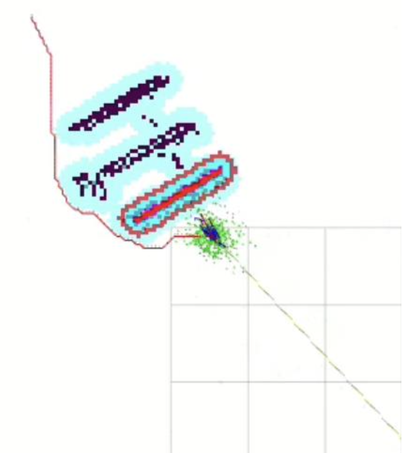
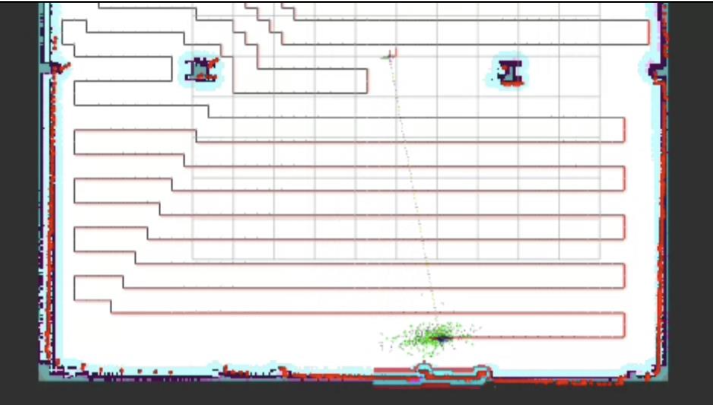

# RXR2025
Robotics &amp; XR 2025 - course related material

# Custom Coverage Path Planner for the Andino Robot

**Author:** Jan Sistonen  
**Program:** Robotics & XR 2025

## 1. Introduction and Goal

The goal of this project was to build a custom Global Path Planner for the Andino robot using
ROS 2 Nav2. The task was to replace the simple “straight line” planner with a smarter algorithm.

I chose a Coverage Path Planning approach. Instead of only finding the shortest path (like A*
or Dijkstra usually do), the planner behaves more like a robot vacuum cleaner or a lawn mower.
The goal is optimal coverage: the robot should pass through as much free space as possible on
the way to the final goal.

## 2. Technical Solution

The solution was developed step-by-step in four phases.

### Phase 1: Straight Line & A* (Proof of Concept)

First I implemented A* (A-star). It found the shortest path while avoiding obstacles using the
Global Costmap data. It worked correctly, and after that I had this idea: instead of finding the
shortest path, how could we find actually the longest one?

### Phase 2: Depth-First Search (DFS)

Next I changed the logic to use Depth-First Search (DFS), which prefers cells that are far from
the goal.

**Problem:**  
The algorithm created tens of thousands of waypoints (72,000 to be precise). Python was too
slow to handle this in real time, so Nav2 timed out.

### Phase 3: Grid Discretization (Downsampling)

To fix the performance issue, I used grid discretization (downsampling).

Nav2’s costmap (5 cm resolution) was grouped into larger **30 cm × 30 cm** cells.  
The planner then calculates the path using these “big cells”.

**Result:**  
Computation became much smaller (about **40× faster**), and the timeout problem disappeared.

### Phase 4: Caching & Path Pruning

The biggest challenge was Nav2’s replanning behavior. Nav2 requests a new path about once per
second. Because a coverage planner tries to fill the area starting from the robot’s current
location, the robot sometimes got stuck looping.

**Solution:**  
I added caching (`self.cached_path`). The planner only creates a new path when the goal changes.

As the robot moves forward, the planner also prunes the path by removing the part already
driven and returns only the remaining part. This prevents endless loops.

## 3. Reflection

This project was very educational, especially for understanding the architecture of ROS 2 and
the Nav2 stack.

### Challenge 1: Performance & Timeouts

The hardest part was understanding why Nav2 rejected my paths at first (timeouts and
timestamps). Although the coverage algorithm worked in theory, in practice it generated over
72,000 waypoints using the native 5 cm costmap resolution.

Because the Python-based DFS had to iterate through tens of thousands of cells, computation
took several seconds. Nav2 interpreted this as a failure and aborted the connection.

This was solved by using grid discretization (30 cm resolution), which reduced computation
dramatically and enabled real-time performance.

### Challenge 2: Replanning & Infinite Loops

Nav2 is stateless and safety-oriented by default. It continuously requests new plans to react
to dynamic obstacles.

A coverage algorithm recalculates paths starting from the current robot position. When Nav2
requested new plans mid-motion, the planner generated new “spaghetti paths” that caused the
robot to loop endlessly.

To solve this, I introduced state (memory) using caching:

1. When a new goal arrives, the coverage path is calculated once and cached.
2. On replanning requests, the planner checks if the goal has changed.
3. If not, it returns only the remaining part of the cached path starting from the closest
   point to the robot.

This allows the robot to progress consistently even though Nav2 believes it is receiving new
plans.

### Successes

- Solved performance issues using grid downsampling
- Implemented caching successfully to stabilize navigation

### Future Ideas

- Implement a more systematic “snake-like” (boustrophedon) motion
- Add a return-to-home behavior after full coverage

## 4. Use of AI Tools

AI (Google Gemini) was used for:

- Debugging Python indentation and list-handling issues
- Discussing Nav2 timeouts and replanning logic
- Generating and adapting A* and DFS structures for ROS 2

All code was tested and integrated by me, and the logic was verified in simulation.

## 5. Links

- **Source code:**  
  https://github.com/jansistonen/RXR2025/blob/main/path_planner_node.py

- **Demo video:**  
  https://youtu.be/Hd1JiJpkEmg

